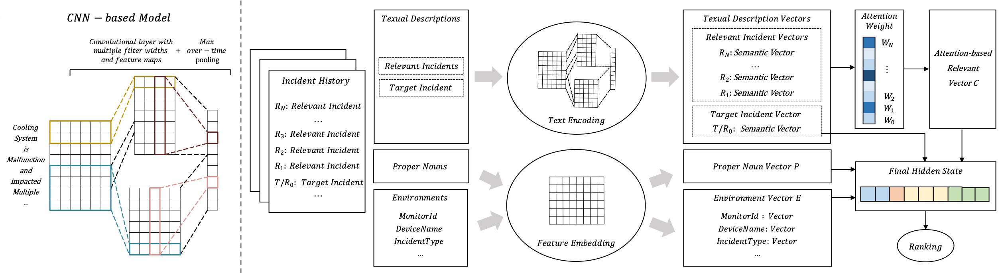

# DeepIP

A deep neural network by using a CNN based model and incorporating an attention mechanism for incident prioritization.

## Introduction

We propose a deep-learning based approach, called DeepIP (Deep learning based Incident Prioritization), to prioritizing incidents by identifying incidental incidents. `DeepTIP.ipynb`

  
  

The overview of the network 

## Compared Approaches

1. Menzies and Marcus, which first applies the standard text mining method to process textual descriptions in reports, and then uses tf-idf (term frequency-inverse document frequency) to transform the textual description in a report to a vector. Finally, it uses the rule classifier based on entropy and information gain to predict bug severity. `Baseline_Rule.ipynb`

2. Lamkanfi et al., which applies the standard text mining method to process text descriptions. Then, it counts token frequency and uses the Naive Bayes algorithm to predict bug severity. `Baseline_Bayes.ipynb`

3. Zhang at al., which applies the standard text mining method and calculates the similarities between a new bug report and historical bug reports using BM25F and LDA (Latent Dirichlet Allocation). According to the similarities, it infers the bug severity based on the top-k nearest neighbors among historical reports (KNN). `Baseline_KNN.ipynb` 

## Generality of DeepIP

To investigate the generality of DeepIP, we evaluated the effectiveness of DeepIP on traditional software bug severity prediction using an open-source dataset. Here, we compared DeepIP with the state-of-the-art bug severity prediction approach (Zhang at al.), and used the same Mozilla dataset released in the compared work. `Mozilla`

## Thanks
